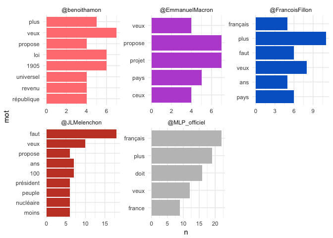
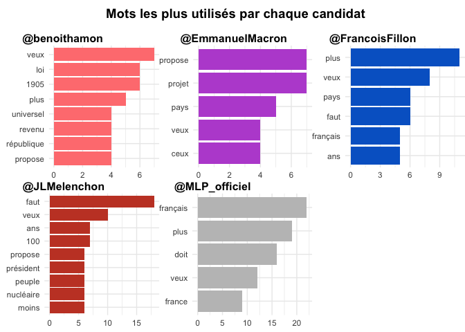
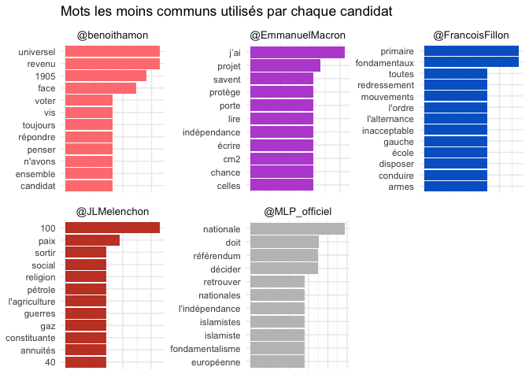

# Débat télévisé du 20 mars 2017
Florian Gaudin-Delrieu  
2017-03-21  
# Qu'ont tweeté les candidats lors du débat ? 
 
Nous avons récupéré les tweets envoyés par les candidats lors du débat télévisé du 20 mars 2017 (le processus est décrit [sur github](https://github.com/ptiflus/TweetsDebat/blob/master/01_Donne%CC%81es.md). Ces tweets par les comptes officiels approximeront le transcript de leurs paroles. Je vais utiliser la librairie `tidytext` pour l'analyse du contenu des tweets.  

Voici les librairies dont nous aurons besoin. Le package `cowplot` servira pour combiner plusieurs graphiques.  
_Note_ : Le code source de ce document est disponible [sur github](https://github.com/ptiflus/TweetsDebat).

```r
library(tidytext)
library(tidyverse)
library(stringr)
library(forcats)
library(DT)
library(cowplot)
```

Lisons maintenant les données. Nous allons modifier le nom des candidats pour ajouter le "@" avant leur nom d'utilisateur twitter, sélectionner les colonnes `nom`, `created_at` (qui donne le moment d'envoi du tweet et servira à identifier les tweets plus loin), `text` (qui contient le texte du tweet) ainsi que d'autres colonnes donnant des méta informations sur les tweets.

Nous définissons aussi les couleurs à partir des couleurs des partis telles que définies sur Wikipedia, et qui nous serviront pour les graphiques.


```r
tweets_debat <- read_csv("tweets_debat.csv", 
                         col_types = cols(
                           .default = col_character(),
                           user_id = col_integer(),
                           created_at = col_datetime(format = ""),
                           status_id = col_double(),
                           retweet_count = col_integer(),
                           favorite_count = col_integer(),
                           is_quote_status = col_logical(),
                           quote_status_id = col_double(),
                           is_retweet = col_logical(),
                           retweet_status_id = col_double(),
                           in_reply_to_status_status_id = col_double(),
                           in_reply_to_status_user_id = col_integer(),
                           media_id = col_double()
                         )) %>% 
  mutate(nom = factor(paste0("@",screen_name))) %>%
  select(-screen_name, -user_id, -status_id, -lang, -urls, -in_reply_to_status_status_id,
         -in_reply_to_status_user_id, -source, -media_id, -media_url, -media_url_expanded, -c(coordinates:bounding_box_type)) %>% 
  select(nom, everything())

couleurs <- c("#FF8080", "#BA55D3", "#0066CC", "#C6442E", "#C0C0C0")
```

## Exploration rapide des tweets

Qui a le plus tweeté ?  
Faisons un histogramme pour le voir.

```r
ggplot(tweets_debat, aes(x = nom)) +
  geom_bar(aes(fill = nom), show.legend = FALSE) +
  scale_fill_manual(values = couleurs) +
  theme_minimal() +
  labs(title = "Marine Le Pen et Jean-Luc Mélenchon ont le plus tweeté",
       x = NULL,
       y = NULL)
```

<!-- -->

Marine Le Pen et Jean-Luc Mélenchon ont nettement plus tweeté que les autres candidats.  

Y a-t-il une forte proportion de retweets ?

```r
with(tweets_debat, tapply(is_retweet, nom, mean))
```

```
##    @benoithamon @EmmanuelMacron @FrancoisFillon    @JLMelenchon 
##       0.0000000       0.0000000       0.0000000       0.1559633 
##   @MLP_officiel 
##       0.0000000
```

Pour Jean-Luc Mélenchon, environ 16% des tweets envoyés pendant le débat sont des retweets, aucun pour les autres candidats. Nous allons filtrer les retweets, vu qu'ils ne représentent pas ce qu'a dit le candidat pendant le débat. Les colonnes `is_quote_status`, `quote_status_id`, `is_retweet` et `retweet_status_id` peuvent être filtrées, vu qu'elles n'apportent aucune information.


```r
tweets_debat <- tweets_debat %>% 
  filter(!is_retweet) %>% 
  select(-c(is_quote_status:retweet_status_id))
```

## Utilisation de `tidytext`

Nous allons maintenant pouvoir commencer à analyser le contenu des tweets. J'utilise ici une expression conseillée sur le site [tidy text mining](http://tidytextmining.com/twitter.html#word-frequencies-1). Cela enlève les liens, mais conserve les hashtags et les mentions.  
Nous utilisons ensuite la fonction `unnest_tokens` qui va générer un data frame avec une ligne par mot, par nom et par created_at (identifiant du tweet).


```r
tidy_tweet <- tweets_debat %>%
  select(1:3) %>% 
  mutate(text = str_replace_all(text,
                                "https://t.co/[A-Za-z\\d]+|http://[A-Za-z\\d]+|&amp;|&lt;|&gt;|RT|https",
                                "")) %>% 
  unnest_tokens(mot, text)
```

Quels sont les mots les plus employés par chaque candidat ?  
Nous pouvons compter les mots pour chaque candidat avec `dplyr::count`.

```r
tidy_tweet %>% 
  group_by(nom) %>% 
  count(mot, sort = TRUE)
```

```
## Source: local data frame [2,226 x 3]
## Groups: nom [5]
## 
##                nom          mot     n
##             <fctr>        <chr> <int>
## 1    @MLP_officiel     débattf1   108
## 2    @MLP_officiel legranddébat   106
## 3     @JLMelenchon legranddébat    86
## 4     @JLMelenchon     débattf1    76
## 5    @MLP_officiel           de    66
## 6    @MLP_officiel           la    64
## 7     @JLMelenchon           de    60
## 8  @FrancoisFillon           de    56
## 9     @JLMelenchon           la    52
## 10    @benoithamon           de    49
## # ... with 2,216 more rows
```

Ce résultat n'est pas très intéressant, on trouve les mots clés du débat (débattf1 et legranddébat), ansi que des mots très communs. Nous allons filtrer les mots les plus communs à partir de la liste de `stopwords("french")` du package `tm`. J'ai ajouté les mots "a" et "c'est", qui ne sont pas dans la liste des stopwords, mais n'apportent pas d'information.

```r
tidy_tweet <- tidy_tweet %>% 
  filter(!mot %in% c("débattf1","legranddébat", "legranddebat", "debattf1", "hamondébat", "hamondebat", "marine2017", "a", "c'est", tm::stopwords("french")))
```

Faisons un graphe des mots les plus employés par chaque candidat.  
Le problème que j'ai rencontré est que certains mots sont employés par plusieurs candidats, mais pas dans le même ordre. Pour avoir dse graphes plus clairs, je pense qu'il faut que pour chaque candidat les mots soient dans le bon ordre. Or, pour classer les mots il faut transformer la colonne en `factor` (en utilisant `forcats::fct_reorder` qui permet de classer un factor en fonction d'une autre colonne), et on ne peut pas utiliser `ggplot2::facet_wrap`. Voici ce qui se passe si on utilise `facet_wrap`.


```r
tidy_tweet %>% 
  count(mot, nom) %>% 
  group_by(nom) %>% 
  top_n(5, n) %>% 
  ungroup() %>% 
  mutate(mot = fct_reorder(mot, n, max)) %>% 
  ggplot(aes(x = mot, y = n, fill = nom)) +
  geom_col(show.legend = FALSE) + 
  facet_wrap(~nom, scales = "free") +
  coord_flip() +
  theme_minimal() +
  scale_fill_manual(values = couleurs)
```

<!-- -->

Cela marche pour Marine Le Pen et Jean-Luc Mélenchon (presque) car ils ont le plus de tweets et qu'il y a donc plus de variabilité dans la distribution des noms, mais pas du tout pour les autres. Il y a beaucoup de mots ayant le même compte, ce qui explique que le top 5 pour chaque candidat donne plus que 5 résultats parfois.  

Pour résoudre ce problème, je vais créer un graphe par candidat et les combiner ensuite. Pour créer chaque graphe, j'utilise `tidyr::nest(-nom)` qui va créer une colonne `data` avec un data frame pour chaque candidat. Ensuite, grâce à la fonction `purrr::map` et de `dplyr::mutate`, je peux réorganiser chaque mot en fonction des données du seul candidat.  

Je crée ensuite une fonction personnalisée pour créer les graphiques à partir de 2 entrées : une correspondant aux données, et l'autre aux couleurs.
Puis nous faisons une liste de graphiques en utilisant la fonction `purrr::map2`, qui me permet de parcourir chacun des jeux de données des candidats (ils sont dans `top_split$top_ordre`), et les couleurs de chaque candidat (dans le vecteur `couleurs`) et d'utiliser notre fonction `creer_graphe_couleur`.  

Les graphiques sont combinés grâce à `cowplot::plot_grid`. Je définis un autre graphe pour le titre avant d'afficher le graphe.


```r
top_split <- tidy_tweet %>% 
  count(mot, nom) %>% 
  group_by(nom) %>% 
  top_n(5, n) %>% 
  ungroup() %>% 
  nest(-nom)  %>% 
  mutate(top_ordre = map(data, ~mutate(.x, mot = fct_reorder(mot, n, max)))) %>% 
  arrange(nom)

creer_graphe_couleur <- function(x, y) {
  ggplot(x, aes(x = mot, y = n)) + 
    geom_col(fill = y, show.legend = FALSE) +
    coord_flip() +
    labs(x = NULL, y = NULL) +
    theme_minimal() +
    theme(plot.margin = unit(c(0.6,0,0,0), "cm"))}

plot_list <- map2(top_split$top_ordre, couleurs,  creer_graphe_couleur)

title <- ggdraw() + draw_label("Mots les plus utilisés par chaque candidat", fontface='bold')

p <- plot_grid(plotlist = plot_list, nrow = 2, labels = top_split$nom,
               label_size = 12, hjust = -0.2)

plot_grid(title, p, ncol=1, rel_heights=c(0.1, 1))
```

<!-- -->

Voilà qui me semble mieux ! Nous pouvons constater que tous les candidats ont le mot "veux" dans leur top 5 des mots les plus utilisés.

## Mots caractéristiques des candidats

Nous allons essayer de trouver des mots caractéristiques pour chaque candidat. Pour ce faire, nous allons regarder la mesure dîte `tf-idf` pour `term frequency, inverse document frequency`. Cela revient à mettre un score élevé à un mot s'il apparaît fréquemment pour un candidat mais pas chez les autres.  
Pour cela nous pouvons utiliser la fonction `bind_tf_idf` du package `tidytext`. Il suffit de lui donner la colonne des mots à calculer, les groupes (ici par candidat) et le nombre de mot par groupe. À noter que comme nous choisissons des mots caractéristiques pour chaque candidat, il n'y a plus le problème vu plus haut, on peut utiliser directement `facet_wrap`.


```r
mot_tfidf_tot <- tidy_tweet %>% 
  count(mot, nom) %>% 
  bind_tf_idf(mot, nom, n)

mot_tfidf <- mot_tfidf_tot %>% 
  group_by(nom) %>% 
  top_n(5, tf_idf)

mot_tfidf %>%
  ggplot(aes(x = fct_reorder(mot, tf_idf, max), y = tf_idf)) +
  geom_col(aes(fill = nom), show.legend = FALSE) +
  facet_wrap(~nom, scales = "free") +
  labs(x = NULL,
       y = NULL,
       title = "Mots les moins communs utilisés par chaque candidat") +
  coord_flip() +
  theme_minimal() +
  theme(axis.text.x = element_blank(),
        axis.ticks.x = element_blank(),
        axis.line.x = element_blank(),
        strip.text = element_text(size = 10),
        strip.background = element_blank()) +
  scale_fill_manual(values = couleurs)
```

<!-- -->

Regardons les tweets qui contiennent les mots arrivant au début des graphes ci-dessus. Cela permettra de les remettre en contexte, et de voir si notre algorithme est plutôt fiable ou non.
Je vais regarder les 3 tweets de chaque candidat ayant le plus grand score de TF-IDF, en sommant le score TF-IDF pour chaque mot du tweet.


```r
top_score <- tidy_tweet %>% 
  left_join(mot_tfidf_tot, by = c("nom", "mot")) %>% 
  group_by(nom, created_at) %>% 
  summarise(score = sum(tf_idf)) %>% 
  top_n(n = 4, score) %>% 
  left_join(tweets_debat, by = c("nom", "created_at")) %>% 
  mutate(score = signif(score, 2)) %>% 
  ungroup() %>% 
  select(nom, score, text)

datatable(top_score)
```

<!--html_preserve--><div id="htmlwidget-a5165a0959b0c88f5c2c" style="width:100%;height:auto;" class="datatables html-widget"></div>
<script type="application/json" data-for="htmlwidget-a5165a0959b0c88f5c2c">{"x":{"filter":"none","data":[["1","2","3","4","5","6","7","8","9","10","11","12","13","14","15","16","17","18","19","20"],["@benoithamon","@benoithamon","@benoithamon","@benoithamon","@EmmanuelMacron","@EmmanuelMacron","@EmmanuelMacron","@EmmanuelMacron","@FrancoisFillon","@FrancoisFillon","@FrancoisFillon","@FrancoisFillon","@JLMelenchon","@JLMelenchon","@JLMelenchon","@JLMelenchon","@MLP_officiel","@MLP_officiel","@MLP_officiel","@MLP_officiel"],[0.065,0.058,0.065,0.064,0.074,0.08,0.085,0.091,0.044,0.042,0.043,0.048,0.055,0.047,0.037,0.037,0.039,0.05,0.056,0.05],["Je veux penser la protection sociale de demain. Le revenu universel éradiquera la précarité.Je serai le candidat du… https://t.co/8vuuj5oI3s","Avec le revenu universel, un jeune qui gagnait 231€ gagnera dorénavant 749€ #LeGrandDébat","Avec le revenu universel, un agriculteur ou une assistante maternelle qui percevait 50% du SMIC verra son pouvoir d’achat augmenter de 397€","Nous devons penser la protection sociale de demain : je propose le revenu universel qui éradiquera la précarité… https://t.co/LMKo0EhEnU","J’ai été ministre et j’ai vu ce qui bloquait notre pays. Des règles hors d’âge, des fonctionnements dépassés. #LeGrandDébat","Le projet que je porte est un projet qui a confiance dans le pays et son énergie. \nC’est un projet porteur d’espoir… https://t.co/SmOHZLwsyQ","Je veux que là où 50 à 60% des élèves ne savent pas lire, écrire et compter en CM2, on porte leur nombre à 12 par c… https://t.co/vIcq7A2KHO","Mon projet est un projet qui protège celles et ceux qui n’y arrivent pas, qui libère celles et ceux qui veulent entreprendre. #LeGrandDébat","Je veux une école primaire qui commence à 5 ans, où 75% du temps des élèves est consacré à l'apprentissage des fondamentaux. #LeGrandDébat","L'insécurité n'a cessé d'augmenter, et en particulier ces dernières semaines. Chaque jour apporte sa dose d'actes de plus en plus violents.","Je mets en garde les Français contre l'illusion d'une retraite par points, qui est une manière de baisser chaque année la valeur du point.","Je suis le seul qui pourra demain disposer d'une majorité cohérente et stable pour conduire le redressement de notre pays.","Je serai le président écologiste : sortie du nucléaire, 100% renouvelables, 100% d'agriculture bio. #LeGrandDébat #DébatTF1","Le grand carénage pour continuer le #nucléaire, c'est 100 milliards. Nous proposons 50 milliards pour la transition… https://t.co/OySe0ereS2","Je propose un impôt avec 14 tranches. Avec, toute personne gagnant moins de 4000 euros paiera moins d'impôts.… https://t.co/2EMwdnSK5U","Il faut apprendre à se passer de pétrole et de gaz. Le choix des énergies renouvelables, c'est le chemin de la paix. #LeGrandDébat #DébatTF1","\"Nous devons retrouver nos frontières nationales, et arrêter l'immigration dont les Français ne peuvent plus.\" #DébatTF1 #LeGrandDébat","\"La France doit décider et personne ne doit décider à sa place, je suis attachée à la liberté des Français.\" #DébatTF1 #LeGrandDébat","\"On doit aller vers 2% du PIB pour le budget de la Défense Nationale, dès 2018. L'armée est aujourd'hui à l'os !\" #DébatTF1 #LeGrandDébat","\"On doit aller vers 2% du PIB pour le budget de la Défense Nationale, dès 2018.\" #DébatTF1 #LeGrandDébat #Marine2017 https://t.co/Vhhg5rT3qA"]],"container":"<table class=\"display\">\n  <thead>\n    <tr>\n      <th> <\/th>\n      <th>nom<\/th>\n      <th>score<\/th>\n      <th>text<\/th>\n    <\/tr>\n  <\/thead>\n<\/table>","options":{"columnDefs":[{"className":"dt-right","targets":2},{"orderable":false,"targets":0}],"order":[],"autoWidth":false,"orderClasses":false}},"evals":[],"jsHooks":[]}</script><!--/html_preserve-->

Le résultat n'est pas très visible, je vais surligner les mots que nous avons trouvé dans les mots caractéristiques pour voir leur répartition. Le vecteur `patterns` créé ci-dessous donne pour chaque candidat leurs mots caractéristiques concaténés avec `|` pour chaque terme soit trouvé indépendemment ensuite.  
Pour remplacer chaque mot par le mot mis en forme (en html), je vais utiliser `stringr::str_replace_all` en utilisant `patterns` créé précédemment, et avec une fonction personnalisée. Comme on ne peut pas donner d'argument à cette fonction dans `str_replace_all` directement, je vais donc créer une liste de fonction, à partir d'une "closure" (i.e. une "usine à fonction"). Ensuite, grâce à `map`, je peux avoir une liste de fonction, permettant de changer la couleur d'un mot. Il faut enfin une boucle `for` pour modifier successivement le champ `text`. A noter aussi que j'utilse `str_to_lower`, vu que les mots sont en bas de casse dans `patterns` et que la recherche dans `str_replace_all` est sensible à la casse.  
Je change aussi les couleurs pour les noms des candidats. Pour cela, je crée une fonction avec 2 arguments, un texte et un indice, qui renvoie la fonction de l'indice appliquée au texte. Je crée une variable temporaire qui va donner l'indice à appliquer, puis j'applique la fonction au nom des candidats. Je pense que je me suis un peu compliqué la vie, si quelqu'un a quelque chose de plus simple, je suis preneur !


```r
patterns <- mot_tfidf %>% 
  top_n(4, tf_idf) %>% 
  select(nom, mot) %>% 
  arrange(nom) %>% 
  group_by(nom) %>% 
  summarise(pattern = str_c(mot, collapse = "|")) %>% 
  `$`(pattern)

add_bold_color <- function(color){
  force(color)
  function(x){
    str_c("<b style=\"color :", color, ";\">", x, "</b>")
  }
}

liste_fun <- map(couleurs, add_bold_color)

for(i in 1:5){
  top_score$text <- str_replace_all(str_to_lower(top_score$text), patterns[i], liste_fun[[i]])
}

changer_couleur <- function(text, i){
  liste_fun[[i]](text)
}

top_score <- top_score %>%
  mutate(candidat = match(nom, levels(nom)),
         nom = as.character(nom),
         nom = map2_chr(nom, candidat, changer_couleur)) %>% 
  select(nom, score, text)
```

Nous pouvons maintenant voir la table avec les couleurs.


```r
top_score %>% 
  group_by(nom) %>% 
  datatable(escape = FALSE, rownames = FALSE, 
            caption = htmltools::tags$caption(style = "color: black",
              htmltools::tags$h3("Quatre meilleurs scores TF-IDF des tweets de chaque candidat."), 
              "Les mots caractéristiques ont été surlignés de la couleur du candidat."),
            options = list(dom = 't', pageLength = 20))
```

<!--html_preserve--><div id="htmlwidget-f043f4e8ad85ec5b9825" style="width:100%;height:auto;" class="datatables html-widget"></div>
<script type="application/json" data-for="htmlwidget-f043f4e8ad85ec5b9825">{"x":{"filter":"none","caption":"<caption style=\"color: black\">\n  <h3>Quatre meilleurs scores TF-IDF des tweets de chaque candidat.<\/h3>\n  Les mots caractéristiques ont été surlignés de la couleur du candidat.\n<\/caption>","data":[["<b style=\"color :#FF8080;\">@benoithamon<\/b>","<b style=\"color :#FF8080;\">@benoithamon<\/b>","<b style=\"color :#FF8080;\">@benoithamon<\/b>","<b style=\"color :#FF8080;\">@benoithamon<\/b>","<b style=\"color :#BA55D3;\">@EmmanuelMacron<\/b>","<b style=\"color :#BA55D3;\">@EmmanuelMacron<\/b>","<b style=\"color :#BA55D3;\">@EmmanuelMacron<\/b>","<b style=\"color :#BA55D3;\">@EmmanuelMacron<\/b>","<b style=\"color :#0066CC;\">@FrancoisFillon<\/b>","<b style=\"color :#0066CC;\">@FrancoisFillon<\/b>","<b style=\"color :#0066CC;\">@FrancoisFillon<\/b>","<b style=\"color :#0066CC;\">@FrancoisFillon<\/b>","<b style=\"color :#C6442E;\">@JLMelenchon<\/b>","<b style=\"color :#C6442E;\">@JLMelenchon<\/b>","<b style=\"color :#C6442E;\">@JLMelenchon<\/b>","<b style=\"color :#C6442E;\">@JLMelenchon<\/b>","<b style=\"color :#C0C0C0;\">@MLP_officiel<\/b>","<b style=\"color :#C0C0C0;\">@MLP_officiel<\/b>","<b style=\"color :#C0C0C0;\">@MLP_officiel<\/b>","<b style=\"color :#C0C0C0;\">@MLP_officiel<\/b>"],[0.065,0.058,0.065,0.064,0.074,0.08,0.085,0.091,0.044,0.042,0.043,0.048,0.055,0.047,0.037,0.037,0.039,0.05,0.056,0.05],["je veux penser la protection <b style=\"color :#c6442e;\">social<\/b>e de demain. le <b style=\"color :#ff8080;\">revenu<\/b> <b style=\"color :#ff8080;\">universel<\/b> éradiquera la précarité.je serai le candidat du… https://t.co/8vuuj5oi3s","avec le <b style=\"color :#ff8080;\">revenu<\/b> <b style=\"color :#ff8080;\">universel<\/b>, un jeune qui gagnait 231€ gagnera dorénavant 749€ #legranddébat","avec le <b style=\"color :#ff8080;\">revenu<\/b> <b style=\"color :#ff8080;\">universel<\/b>, un agriculteur ou une assistante maternelle qui percevait 50% du smic verra son pouvoir d’achat augmenter de 397€","nous devons penser la protection <b style=\"color :#c6442e;\">social<\/b>e de demain : je propose le <b style=\"color :#ff8080;\">revenu<\/b> <b style=\"color :#ff8080;\">universel<\/b> qui éradiquera la précarité… https://t.co/lmko0ehenu","<b style=\"color :#ba55d3;\">j’ai<\/b> été ministre et <b style=\"color :#ba55d3;\">j’ai<\/b> vu ce qui bloquait notre pays. des règles hors d’âge, des fonctionnements dépassés. #legranddébat","le <b style=\"color :#ba55d3;\">projet<\/b> que je <b style=\"color :#ba55d3;\">porte<\/b> est un <b style=\"color :#ba55d3;\">projet<\/b> qui a confiance dans le pays et son énergie. \nc’est un <b style=\"color :#ba55d3;\">projet<\/b> <b style=\"color :#ba55d3;\">porte<\/b>ur d’espoir… https://t.co/smohzlwsyq","je veux que là où 50 à 60% des élèves ne <b style=\"color :#ba55d3;\">savent<\/b> pas <b style=\"color :#ba55d3;\">lire<\/b>, <b style=\"color :#ba55d3;\">écrire<\/b> et compter en <b style=\"color :#ba55d3;\">cm2<\/b>, on <b style=\"color :#ba55d3;\">porte<\/b> leur nombre à 12 par c… https://t.co/vicq7a2kho","mon <b style=\"color :#ba55d3;\">projet<\/b> est un <b style=\"color :#ba55d3;\">projet<\/b> qui <b style=\"color :#ba55d3;\">protège<\/b> <b style=\"color :#ba55d3;\">celles<\/b> et ceux qui n’y arrivent pas, qui libère <b style=\"color :#ba55d3;\">celles<\/b> et ceux qui veulent entreprendre. #legranddébat","je veux une <b style=\"color :#0066cc;\">école<\/b> <b style=\"color :#0066cc;\">primaire<\/b> qui commence à 5 ans, où 75% du temps des élèves est consacré à l'apprentissage des <b style=\"color :#0066cc;\">fondamentaux<\/b>. #legranddébat","l'insécurité n'a cessé d'augmenter, et en particulier ces dernières semaines. chaque jour ap<b style=\"color :#ba55d3;\">porte<\/b> sa dose d'actes de plus en plus violents.","je mets en garde les français contre l'illusion d'une retraite par points, qui est une manière de baisser chaque année la valeur du point.","je suis le seul qui pourra demain <b style=\"color :#0066cc;\">disposer<\/b> d'une majorité cohérente et stable pour <b style=\"color :#0066cc;\">conduire<\/b> le <b style=\"color :#0066cc;\">redressement<\/b> de notre pays.","je serai le président écologiste : sortie du nucléaire, <b style=\"color :#c6442e;\">100<\/b>% renouvelables, <b style=\"color :#c6442e;\">100<\/b>% d'agriculture bio. #legranddébat #débattf1","le grand carénage pour continuer le #nucléaire, c'est <b style=\"color :#c6442e;\">100<\/b> milliards. nous proposons 50 milliards pour la transition… https://t.co/oyse0eres2","je propose un impôt avec 14 tranches. avec, toute personne gagnant moins de <b style=\"color :#c6442e;\">40<\/b>00 euros paiera moins d'impôts.… https://t.co/2emwdnsk5u","il faut apprendre à se passer de <b style=\"color :#c6442e;\">pétrole<\/b> et de <b style=\"color :#c6442e;\">gaz<\/b>. le choix des énergies renouvelables, c'est le chemin de la <b style=\"color :#c6442e;\">paix<\/b>. #legranddébat #débattf1","\"nous devons retrouver nos frontières <b style=\"color :#C0C0C0;\">nationale<\/b>s, et arrêter l'immigration dont les français ne peuvent plus.\" #débattf1 #legranddébat","\"la france <b style=\"color :#C0C0C0;\">doit<\/b> <b style=\"color :#C0C0C0;\">décider<\/b> et personne ne <b style=\"color :#C0C0C0;\">doit<\/b> <b style=\"color :#C0C0C0;\">décider<\/b> à sa place, je suis attachée à la liberté des français.\" #débattf1 #legranddébat","\"on <b style=\"color :#C0C0C0;\">doit<\/b> aller vers 2% du pib pour le budget de la défense <b style=\"color :#C0C0C0;\">nationale<\/b>, dès 2018. l'armée est aujourd'hui à l'os !\" #débattf1 #legranddébat","\"on <b style=\"color :#C0C0C0;\">doit<\/b> aller vers 2% du pib pour le budget de la défense <b style=\"color :#C0C0C0;\">nationale<\/b>, dès 2018.\" #débattf1 #legranddébat #marine2017 https://t.co/vhhg5rt3qa"]],"container":"<table class=\"display\">\n  <thead>\n    <tr>\n      <th>nom<\/th>\n      <th>score<\/th>\n      <th>text<\/th>\n    <\/tr>\n  <\/thead>\n<\/table>","options":{"dom":"t","pageLength":20,"columnDefs":[{"className":"dt-right","targets":1}],"order":[],"autoWidth":false,"orderClasses":false,"lengthMenu":[10,20,25,50,100]}},"evals":[],"jsHooks":[]}</script><!--/html_preserve-->

***     
   
Nous voyons que quelques mots caractéristiques pour un candidat se retrouvent chez les autres (par exemple sociale est plus caractéristique de Jean-Luc Mélenchon mais se retrouve aussi chez Benoît Hamon).
Nous pouvons constater que :

* Benoît Hamon parle de revenu universel ;
* Jean-Luc Mélenchon donne des chiffres ronds et parle de paix ;
* Marine Le Pen veut des frontières et des priorités nationales et insiste sur le devoir ;
* François Fillon parle d'école primaire et de primaire de la droite (notre algorihtme ne peut pas les distinguer), ainsi que de fondamentaux ;
* et Emmanuel Macron parle de ce qu'il a fait et de son projet (quand il parle de projet, il est deux fois dans le même tweet).

Nous voyons aussi, si l'on classe les tweets par score, qu'Emmanuel Macron est celui qui emploie le plus ses mots caractéristique, et que François Fillon est celui qui les utilise le moins. Ce dernier a donc tweeté plus de mots utilisés aussi par les autres candidats.

## Conclusion

Cette analyse rapide des tweets envoyés par les candidats a permis de faire ressortir les thèmes et styles de chacun des six candidats. Ce n'est pas parfait, mais les thèmes ressortis sont assez pertinents (Benoît Hamon est effectivement le seul à parler de revenu universel). Les données provenant d'une centaine de tweets ne sont pas très importantes, mais cela semble suffire.  
Le package `tidytext` permet facilement de faire ressortir les sujets et s'insère très bien dans le `tidyverse`.
