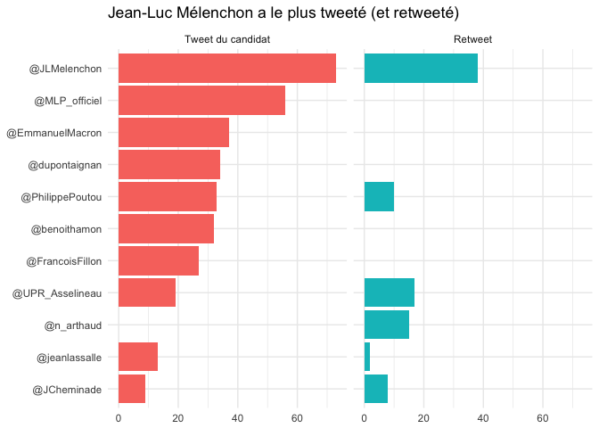

# Tweets du débat du 4 avril
Florian Gaudin-Delrieu  
5 avril 2017  


## Objectif

Je vais réutiliser le code du débat précédent pour faire une analyse plsu rapide des tweets des candidats. Je vais en profiter aussi pour automatiser certaines étapes en les incluant dans des fonctions.


```r
library(rtweet)
library(tidyverse)
library(stringr)
library(lubridate)
library(tidytext)
library(forcats)
library(DT)
library(cowplot)
```

## Récupération des données

Il faut récupérer la liste des tweets des 11 partipants au débat. Il faut aussi changer l'heure du débat. J'ai pris un peu de marge sur les horaires de débat pour être sûr de prendre tous les tweets.  
J'ai automatisé la récupération dans une fonction `recuperer_tweets()`, qui prend comme arguments un vecteur avec les noms des comptes twitters des candidats à récupérer (sans le @), et les heures, sous forme d'intervalle (`lubridate::interval`), ainsi qu'un argument facultatif pour le nombre de tweets à récupérer (cela pourra servir si la recherche est relancée plus tard, la fonction `get_timeline()` récupérant les tweets à partir des derniers postés).  
A noter que j'ai gardé les retweets, sinon Nathalie Arthaud n'aurait eu aucun tweet pendant le débat. Pour pouvoir les analyser, je récupère aussi le nom de la personne retweetée.


```r
heures_debat <- interval(ymd_hm("20170404_1800"), 
                         ymd_hm("20170405_0200"))

candidats <- c("benoithamon", "JLMelenchon","EmmanuelMacron",
               "MLP_officiel", "FrancoisFillon", "UPR_Asselineau",
               "JCheminade", "jeanlassalle", "dupontaignan",
               "n_arthaud", "PhilippePoutou")

recuperer_tweets <- function(candidats, heures, n = 200) {
  # Récupération
  tous_tweets <- map(candidats, get_timeline, n)
  
  # Vérification que les heures du débat sont bien comprises dans les heures
  # des tweets récupérés
  stopifnot(all(map_lgl(tous_tweets, 
                        ~heures %within% interval(min(.x$created_at),
                                                  max(.x$created_at)))))
  
  # Filtres pour ne prendre que les tweets des heures choisies
  # et ne choisir que les champs voulus
  map_df(tous_tweets, ~filter(.x, .x$created_at %within% heures)) %>% 
    select(nom = screen_name, time = created_at, tweet = text, is_retweet, rt_nom = mentions_screen_name) %>% 
    mutate(nom = str_c("@", nom),
           nom = as.factor(nom),
           rt_nom = if_else(is_retweet, str_extract(rt_nom,"\\w+"), NA_character_))
}
```

Nous pouvons maintenant récupérer les tweets. Je vais sauvegarder les données dans un csv pour que cela soit plus simple de refaire l'analyse plus tard.


```r
# tweets_debats <- recuperer_tweets(candidats, heures_debat)
# write_csv(tweets_debats, "tweets_debat_20170404.csv")
tweets_debat <- read_csv("tweets_debat_20170404.csv",
                          col_types = cols(nom = col_factor(levels = str_c("@", sort(candidats))),
                                           time = col_datetime(format = ),
                                           tweet = col_character(),
                                           is_retweet = col_logical(),
                                           rt_nom = col_character()))

couleurs <- c("#FF8080","dupontaignan", "#BA55D3", "#0066CC", "#C6442E", "#C0C0C0")
```

## Analyse des méta-données

Nous allons regarder dans un premier temps les méta-données : combien de tweets par candidats, combien de retweets, de qui proviennent ces retweets ?

### Combien de tweets par candidats ?


```r
nb_tweets <- tweets_debat %>% 
  group_by(is_retweet) %>% 
  count(nom) %>% 
  ungroup() %>% 
  mutate(nom = fct_reorder(nom, n, max),
         is_retweet = factor(is_retweet, levels = c("FALSE", "TRUE"), labels = c("Tweet du candidat", "Retweet")))

ggplot(nb_tweets, aes(x = nom, y = n)) +
  geom_col(aes(fill = is_retweet), show.legend = FALSE) +
  facet_wrap(~is_retweet) +
  theme_minimal() +
  coord_flip() +
  labs(title = "Jean-Luc Mélenchon a le plus tweeté (et retweeté)",
       x = NULL,
       y = NULL) +
  theme(legend.position = "top")
```

<!-- -->

Près de la moitié des candidats n'ont pas retweeté, et Nathalie Arthaud n'a fait que retwetter pendant le débat.

### Analyse des retweets

Qui sont les personnes retweetées ?


